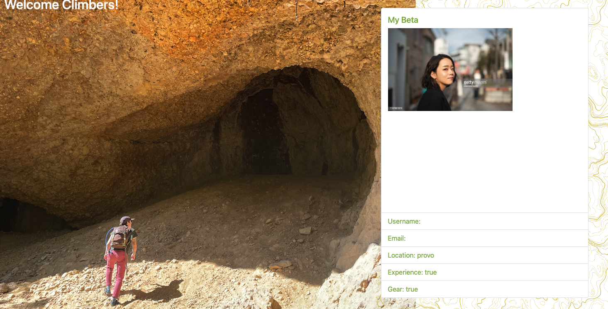
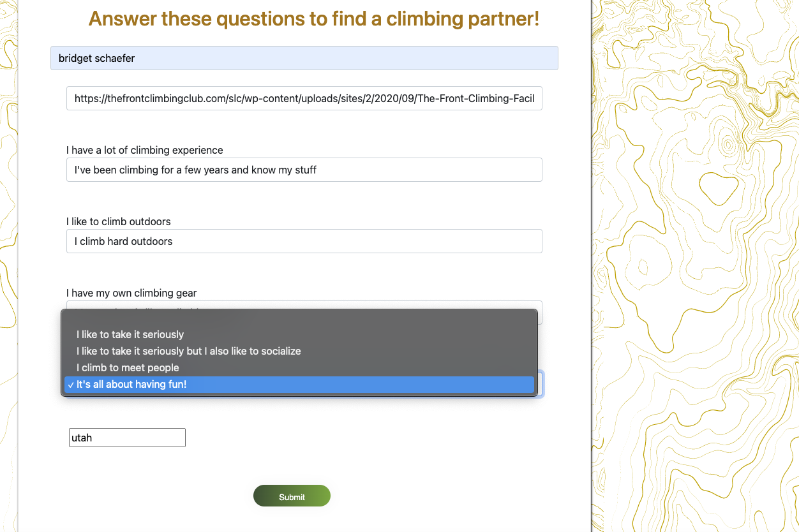

  # Randonneé

  ## Description:
  Randonneé is a climbing database that people can join and fill out a form that scores them based on their answers. Once their score is taken they will be matched with other profiles based on their scores. Profile data is stored with express-session npm package for authentication and sequelize as the ORM. 

  ## Installation Instructions:
  No installation required.

  ## Table of Contents
  - [Description](#description)
  - [License](#license)
  - [Contact Me](#contact)
  - [Github](#github)
  - [Contributors](#contribution)
  - [Instillation](#install)

  ## User Story 
  - AS A rock climber 
  - I WANT to find climbing partners 
  - SO THAT I can climb with people with similar climbing goals 

  ## Visuals 
  
  
  

  ## Github
  -- https://github.com/brotherson67/Randonne

  ## License
  -- N/A

  ## Languages used:
  -- JavaScript, HTML, CSS, Handlebars

  ## Other technologies used
  - Sequelize
  - Express.js
  - Express-session
  - Bycrypt
  - MapBox API 

  ## Project Contributors:
  -- Bridget Schaefer, Ben Chaplin, Mitchell Brotherson

  ## Contact for code questions or inquiries
  -- Email: bridget.schaefer31@gmail.com, mitchell.brotherson@gmail.com, bchaplin525@gmail.com
  -- Github: bridgetvon, brotherson67, Plaindemon
